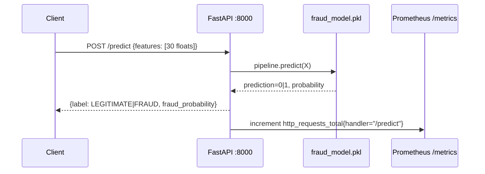
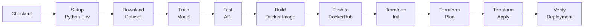
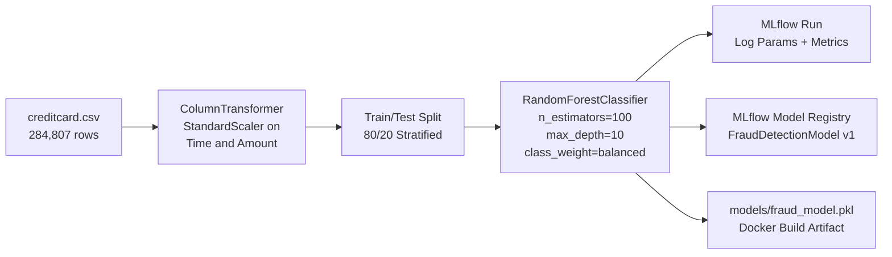

# Real-Time Fraud Detection System


**Author:** Syed Aun Ali Kazmi | **SAP ID:** 70149156  
**Course:** Machine Learning Operations (MLOps) — 6th Semester, BS Embedded Systems Engineering  
**Institution:** University of Lahore

---

## Overview

This project builds a production-grade, real-time credit card fraud detection system using a complete MLOps pipeline. A Random Forest classifier trained on 284,807 real European credit card transactions serves predictions through a FastAPI REST API. The entire lifecycle — from model training and experiment tracking to containerization, orchestration, automated deployment, and live monitoring — is automated and reproducible.

The system answers a single question at runtime: given a set of transaction features, is this transaction fraudulent or legitimate? It does so in milliseconds via a containerized API running on a Kubernetes cluster with three replicas for high availability.

---

## Key Features

- Trained on real, non-synthetic transaction data (not a toy dataset)
- Full experiment tracking and model versioning through MLflow
- REST API with automatic OpenAPI documentation at `/docs`
- Prometheus metrics exposed at `/metrics` for every prediction request
- Three-replica Kubernetes deployment providing load distribution and fault tolerance
- Kubernetes infrastructure defined entirely in Terraform — no manual `kubectl apply`
- Eleven-stage Jenkins CI/CD pipeline: from dataset download to live deployment verification
- Grafana dashboards visualize API request rates, pod health, and fraud prediction traffic in real time
- All configuration is environment-variable driven with no hardcoded secrets

---

## System Architecture and Agent Workflow

```mermaid
flowchart TD
    A([User / Client\nTransaction Request]) --> B[FastAPI Application\nFraud Prediction API]
    B --> C[Random Forest Model\nScikit-learn Pipeline]
    C -->|logs params, metrics| D[(MLflow\nExperiment Tracking\nModel Registry)]
    C -->|saved artifact| E[Docker Container\nContainerized Application]

    subgraph IaC [Infrastructure as Code]
        TF[Terraform\nhashicorp/kubernetes provider]
    end

    subgraph CI_CD [CI/CD]
        GH[GitHub Repository] --> JK[Jenkins Pipeline\n11 Stages]
    end

    TF --> K8S
    JK --> K8S

    subgraph K8S [Kubernetes Cluster — Minikube]
        E --> DEP[Deployment]
        DEP --> RS[ReplicaSet\n3 Running Pods]
        RS --> SVC[NodePort Service\nPort 30080]
    end

    subgraph MON [Monitoring Stack]
        PROM[Prometheus\nScrapes /metrics] --> GRAF[Grafana\nVisualization Dashboard]
    end

    K8S --> MON
```



### Request Flow



### CI/CD Pipeline Stages



### ML Training Pipeline



---

## Tech Stack

| Layer | Tool | Version | Purpose |
|---|---|---|---|
| Language | Python | 3.12 | Core runtime |
| ML | Scikit-learn | 1.5.0 | Random Forest classifier and preprocessing pipeline |
| Experiment Tracking | MLflow | 2.14.3 | Log parameters, metrics, artifacts, model registry |
| API | FastAPI | 0.111.0 | Prediction REST API with auto-generated OpenAPI docs |
| API Server | Uvicorn | 0.30.1 | ASGI server for FastAPI |
| Containerization | Docker | 24.x | Build and ship the application image |
| Image Registry | DockerHub | — | Store and distribute the container image |
| Orchestration | Kubernetes / Minikube | 1.30 | Run three replicas, manage rolling updates |
| Infrastructure as Code | Terraform | 1.8+ | Provision Kubernetes namespace, deployment, and service |
| CI/CD | Jenkins | LTS | Automate the full pipeline from training to deployment |
| Metrics Collection | Prometheus | Helm chart | Scrape `/metrics` from all pods |
| Visualization | Grafana | Helm chart | Display request rates, pod health, fraud traffic |
| Package Management | Helm | 3.x | Install Prometheus and Grafana on Kubernetes |

---

## Project Structure

```
fraud-detection-mlops/
├── src/
│   ├── __init__.py
│   ├── train.py              # model training, MLflow logging, model registry
│   └── main.py               # FastAPI app with /predict, /health, /metrics
├── tests/
│   ├── __init__.py
│   └── test_api.py           # pytest unit tests for all API endpoints
├── terraform/
│   ├── main.tf               # namespace, deployment (3 replicas), service
│   ├── variables.tf          # docker_image, replicas, namespace, app_port
│   └── outputs.tf            # namespace, service_name, node_port
├── monitoring/
│   ├── prometheus-values.yaml  # Helm values — pod annotation scraping
│   └── grafana-values.yaml     # Helm values — Prometheus datasource, dashboard
├── data/
│   └── creditcard.csv        # gitignored — download from Kaggle
├── models/
│   └── fraud_model.pkl       # gitignored — generated by train.py
├── mlruns/                   # gitignored — MLflow local tracking store
├── Dockerfile
├── .dockerignore
├── .gitignore
├── requirements.txt
├── Jenkinsfile               # 11-stage declarative pipeline
└── README.md
```

---

## Dataset

| Property | Value |
|---|---|
| Source | Worldline and ULB Machine Learning Group |
| Kaggle Identifier | mlg-ulb/creditcardfraud |
| Transactions | 284,807 |
| Fraud Cases | 492 (0.172%) |
| Features | 30 — Time, V1–V28 (PCA-anonymized), Amount |
| Target | Class — 0 = Legitimate, 1 = Fraud |
| Period | September 2013, European cardholders |

The dataset is not included in this repository due to its size (143 MB). See the [Installation](#installation) section for download instructions.

---

## Model Performance

Evaluated on a stratified 20% test split (56,962 samples, 98 fraud cases):

| Metric | Score |
|---|---|
| Accuracy | 0.9994 |
| Precision | 0.8100 |
| Recall | 0.8265 |
| F1-Score | 0.8182 |
| ROC-AUC | 0.9811 |

The classifier uses `class_weight="balanced"` to compensate for the 577:1 class imbalance without discarding legitimate samples through undersampling.

---

## Prerequisites

Install the following on WSL Ubuntu 24.04 before proceeding:

| Tool | Minimum Version | Install Reference |
|---|---|---|
| Python | 3.12 | `sudo apt install python3 python3-pip python3-venv` |
| Docker | 24.x | `sudo apt install docker.io` |
| kubectl | 1.30 | [kubernetes.io/docs](https://kubernetes.io/docs/tasks/tools/) |
| Minikube | 1.33 | [minikube.sigs.k8s.io](https://minikube.sigs.k8s.io/docs/start/) |
| Terraform | 1.8+ | HashiCorp APT repository |
| Helm | 3.x | Helm APT repository |
| Java JDK | 17+ | Required for Jenkins WAR |
| Jenkins | LTS | `jenkins.war` or system package |
| Kaggle CLI | latest | `pip install kaggle` |
| DockerHub Account | — | [hub.docker.com](https://hub.docker.com) — free account required |

---

## Installation

### 1. Clone the repository

```bash
git clone https://github.com/YOUR_GITHUB_USERNAME/fraud-detection-mlops.git
cd fraud-detection-mlops
```

### 2. Create and activate virtual environment

```bash
python3 -m venv venv
source venv/bin/activate
pip install --upgrade pip "setuptools==69.5.1" wheel
pip install -r requirements.txt
```

> Note: `setuptools==69.5.1` is pinned explicitly. Python 3.12 venvs do not include setuptools by default, and MLflow 2.14.3 requires `pkg_resources` which ships with setuptools.

### 3. Acquire the dataset

```bash
# Place your kaggle.json API token first
mkdir -p ~/.kaggle
cp /path/to/kaggle.json ~/.kaggle/kaggle.json
chmod 600 ~/.kaggle/kaggle.json

# Download and extract
mkdir -p data
kaggle datasets download -d mlg-ulb/creditcardfraud -p data/ --unzip

# Verify
python3 -c "import pandas as pd; df=pd.read_csv('data/creditcard.csv'); print(df.shape)"
# Expected: (284807, 31)
```

### 4. Train the model

```bash
python src/train.py
```

Expected output:
```
Dataset: 284,807 rows | 492 fraud | 0.173% fraud rate
Training Random Forest ...
  accuracy:  0.9994
  f1_score:  0.8182
  roc_auc:   0.9811
Model saved -> models/fraud_model.pkl
Model registered in MLflow Model Registry
```

### 5. Start MLflow UI

```bash
nohup mlflow ui --host 0.0.0.0 --port 5001 \
  --backend-store-uri file:$(pwd)/mlruns > mlflow.log 2>&1 &
# Open: http://localhost:5001
```

### 6. Start the API

```bash
uvicorn src.main:app --host 0.0.0.0 --port 8000 --reload
# Docs: http://localhost:8000/docs
# Metrics: http://localhost:8000/metrics
```

---

## Environment Variables

The application reads the following environment variables at runtime. All have defaults that work for local development.

| Variable | Default | Where Used | Description |
|---|---|---|---|
| `MLFLOW_TRACKING_URI` | `file:./mlruns` | `train.py` | MLflow backend store URI |
| `DATA_PATH` | `data/creditcard.csv` | `train.py` | Path to the training dataset |
| `MODEL_PATH` | `models/fraud_model.pkl` | `main.py` | Path to the serialized model pipeline |

For Docker and Kubernetes, `MODEL_PATH` is set to `models/fraud_model.pkl` (the model is copied into the image at build time).

No `.env` file is required for local development. For Jenkins, secrets are stored as Jenkins credentials (see [CI/CD Pipeline](#cicd-pipeline)).

---

## Usage

### Predict a transaction

Send 30 features in order: `[Time, V1, V2, ..., V28, Amount]`

```bash
curl -X POST http://localhost:8000/predict \
  -H "Content-Type: application/json" \
  -d '{"features":[0.0,-1.36,-0.07,2.54,1.38,-0.34,0.46,0.24,
       0.10,0.36,0.09,-0.55,-0.62,-0.99,-0.31,1.47,-0.47,0.21,
       0.02,0.40,0.25,-0.02,0.28,-0.11,0.07,0.13,-0.19,0.13,
       -0.02,149.62]}'
```

Response:

```json
{
  "prediction": 0,
  "label": "LEGITIMATE",
  "fraud_probability": 0.0073,
  "confidence": 0.9927
}
```

### API Endpoints

| Method | Path | Description |
|---|---|---|
| `GET` | `/` | Project metadata — name, author, SAP ID, version |
| `GET` | `/health` | Liveness check — returns model load status |
| `POST` | `/predict` | Fraud prediction — accepts 30 transaction features |
| `GET` | `/docs` | Interactive Swagger UI |
| `GET` | `/metrics` | Prometheus-formatted metrics for scraping |

### Run tests

```bash
cd fraud-detection-mlops
pytest tests/ -v
# Expected: 4 passed
```

---

## Docker

### Build

```bash
# Model must be trained first (models/fraud_model.pkl must exist)
docker build -t YOUR_DOCKERHUB_USERNAME/fraud-detection:latest .
```

### Run locally

```bash
docker run -d -p 8000:8000 YOUR_DOCKERHUB_USERNAME/fraud-detection:latest
curl http://localhost:8000/health
```

### Push to DockerHub

```bash
docker login
docker push YOUR_DOCKERHUB_USERNAME/fraud-detection:latest
```

---

## Kubernetes Deployment with Terraform

Terraform provisions three Kubernetes resources: a namespace, a deployment with three replicas, and a NodePort service on port 30080.

```bash
# Start Minikube
minikube start --driver=docker --cpus=4 --memory=4096

# Deploy
cd terraform
terraform init
terraform plan
terraform apply -auto-approve

# Verify
kubectl get pods -n fraud-detection       # 3 pods Running
kubectl get replicaset -n fraud-detection
kubectl get services -n fraud-detection

# Test via NodePort
MINIKUBE_IP=$(minikube ip)
curl http://$MINIKUBE_IP:30080/health
```

To destroy:

```bash
terraform destroy -auto-approve
```

---

## CI/CD Pipeline

The Jenkinsfile defines eleven stages that run sequentially on every push to `main`.

### Required Jenkins Credentials

| Credential ID | Kind | Contents |
|---|---|---|
| `dockerhub-creds` | Username with password | DockerHub username and password |
| `kaggle-json` | Secret file | Your `kaggle.json` API token file |

### Setup

1. Open Jenkins at `http://localhost:8080`
2. Create a Pipeline job named `fraud-detection-pipeline`
3. Set Definition to **Pipeline script from SCM**, point to this repository, branch `main`, script path `Jenkinsfile`
4. Add the two credentials above under **Manage Jenkins > Credentials**
5. Grant Jenkins access to Docker and kubectl:

```bash
sudo usermod -aG docker jenkins
sudo mkdir -p /var/lib/jenkins/.kube
sudo cp ~/.kube/config /var/lib/jenkins/.kube/config
sudo chown -R jenkins:jenkins /var/lib/jenkins/.kube
sudo systemctl restart jenkins
```

6. Click **Build Now**

All eleven stages must complete green. The `DOCKER_TAG` is set to `${BUILD_NUMBER}` so each build produces a versioned image.

---

## Monitoring

Prometheus and Grafana are installed via Helm into a dedicated `monitoring` namespace. Prometheus discovers fraud-detection pods automatically through pod annotations set by Terraform.

### Install

```bash
helm repo add prometheus-community https://prometheus-community.github.io/helm-charts
helm repo add grafana https://grafana.github.io/helm-charts
helm repo update
kubectl create namespace monitoring

helm install prometheus prometheus-community/prometheus \
  --namespace monitoring -f monitoring/prometheus-values.yaml

helm install grafana grafana/grafana \
  --namespace monitoring -f monitoring/grafana-values.yaml
```

### Access

```bash
MINIKUBE_IP=$(minikube ip)
echo "Prometheus: http://$MINIKUBE_IP:30090"
echo "Grafana:    http://$MINIKUBE_IP:30030"
# Grafana login: admin / admin123
```

### Key Prometheus Queries

| Query | What it shows |
|---|---|
| `http_requests_total{handler="/predict"}` | Total fraud prediction requests |
| `http_request_duration_seconds_bucket` | API response time distribution |
| `up{job="fraud-detection-api"}` | Pod availability — 1 = up, 0 = down |

---

## Configuration Reference

### terraform/variables.tf defaults

| Variable | Default | Description |
|---|---|---|
| `docker_image` | `YOUR_DOCKERHUB_USERNAME/fraud-detection:latest` | Image pulled by Kubernetes |
| `replicas` | `3` | Pod count in the ReplicaSet |
| `namespace` | `fraud-detection` | Kubernetes namespace |
| `app_port` | `8000` | Container port |

---

## License

This project is licensed under the MIT License.

```
MIT License

Copyright (c) 2026 Syed Aun Ali Kazmi

Permission is hereby granted, free of charge, to any person obtaining a copy
of this software and associated documentation files (the "Software"), to deal
in the Software without restriction, including without limitation the rights
to use, copy, modify, merge, publish, distribute, sublicense, and/or sell
copies of the Software, and to permit persons to whom the Software is
furnished to do so, subject to the following conditions:

The above copyright notice and this permission notice shall be included in all
copies or substantial portions of the Software.

THE SOFTWARE IS PROVIDED "AS IS", WITHOUT WARRANTY OF ANY KIND, EXPRESS OR
IMPLIED, INCLUDING BUT NOT LIMITED TO THE WARRANTIES OF MERCHANTABILITY,
FITNESS FOR A PARTICULAR PURPOSE AND NONINFRINGEMENT. IN NO EVENT SHALL THE
AUTHORS OR COPYRIGHT HOLDERS BE LIABLE FOR ANY CLAIM, DAMAGES OR OTHER
LIABILITY, WHETHER IN AN ACTION OF CONTRACT, TORT OR OTHERWISE, ARISING FROM,
OUT OF OR IN CONNECTION WITH THE SOFTWARE OR THE USE OR OTHER DEALINGS IN THE
SOFTWARE.
```

---

## Acknowledgements and Data Sources

### Dataset

The credit card transaction dataset used in this project was collected and made available by:

> Andrea Dal Pozzolo, Olivier Caelen, Reid A. Johnson, and Gianluca Bontempi.  
> *Calibrating Probability with Undersampling for Unbalanced Classification.*  
> In Symposium on Computational Intelligence and Data Mining (CIDM), IEEE, 2015.

The dataset is hosted publicly on Kaggle at:  
https://www.kaggle.com/datasets/mlg-ulb/creditcardfraud

It was created by the Machine Learning Group at Universite Libre de Bruxelles (ULB) in collaboration with Worldline. The V1–V28 features are the result of a PCA transformation applied to protect cardholder confidentiality. Only Time and Amount were not transformed.

### Academic Context

This project was developed as Project 4 for the Machine Learning Operations (MLOps) course, 6th Semester, BS Embedded Systems Engineering, University of Lahore, under the guidance of the course instructor.

### Open-Source Tools

This project builds on the following open-source projects: MLflow (Databricks), FastAPI (Sebastián Ramírez), Scikit-learn (INRIA), Prometheus (CNCF), Grafana (Grafana Labs), Terraform (HashiCorp), Jenkins (Jenkins Community), Docker, and Kubernetes.
